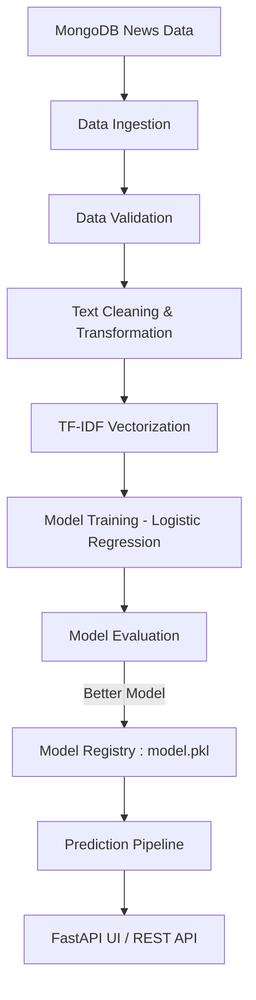

<div align="center">

# 📰 News Topic Classification

**An end-to-end NLP system that ingests raw news articles, trains a text classifier, and serves real-time predictions through a FastAPI interface.**

*Designed with production-grade MLOps principles: modular pipelines, automated CI, Dockerized deployment, and clean model versioning.*

</div>

---

## 📌 Project Overview

This project demonstrates a complete Machine Learning lifecycle for **News Topic Classification**, covering everything from raw data ingestion to live prediction via a web interface.

### What this system does:

* ✅ Fetches news data from MongoDB
* ✅ Performs validation, cleaning, and normalization
* ✅ Trains a high-performing TF‑IDF + Logistic Regression model
* ✅ Compares models and keeps only the best-performing one
* ✅ Exposes predictions via FastAPI Web UI & REST API
* ✅ Automates retraining and Docker builds through CI

---

## 🔄 End-to-End Workflow (Visual Pipeline)



---

## ⚙️ Component Responsibilities

| Stage                   | File                     | Responsibility                                                      |
| ----------------------- | ------------------------ | ------------------------------------------------------------------- |
| **Data Ingestion**      | `data_ingestion.py`      | Pulls data from MongoDB and stores train/test datasets as artifacts |
| **Data Validation**     | `data_validation.py`     | Schema checking & column consistency validation                     |
| **Data Transformation** | `data_transformation.py` | NLP preprocessing: cleaning, lemmatization, normalization           |
| **Model Training**      | `model_trainer.py`       | TF-IDF vectorization and Logistic Regression training               |
| **Model Evaluation**    | `model_evaluation.py`    | Compares new model with existing production model                   |
| **Prediction**          | `prediction_pipeline.py` | Handles inference and label mapping                                 |

---

## 🚀 Getting Started (Local Setup)

### 1. Clone & Install

```bash
git clone https://github.com/<your-username>/News-topic-classification.git
cd News-topic-classification
python -m venv .venv
source .venv/bin/activate     # Windows: .venv\\Scripts\\activate
pip install --upgrade pip
pip install -r requirements.txt
```

### 2. Environment Configuration

Create a `.env` file:

```
MONGODB_URL=your_mongodb_connection_string
```

### 3. Train Model

```bash
python src/pipeline/training_pipeline.py
```

### 4. Test Saved Model

```bash
python model_testing.py
```

### 5. Launch FastAPI App

```bash
uvicorn app:app --reload --port 8000
```

Access:

* UI: [http://127.0.0.1:8000](http://127.0.0.1:8000)
* Classifier: [http://127.0.0.1:8000/classifier](http://127.0.0.1:8000/classifier)

API Usage:

```json
POST /classify
{
  "text": "US Markets rally as tech stocks surge"
}
```

Response:

```json
{
  "topic": "Business"
}
```

---

## 🧪 Continuous Integration (CI)

The CI pipeline triggers on every push to `main`:

* Runs code linting & validation
* Detects training-related changes
* Retrains model if required
* Builds a new Docker image
* Tags image with commit hash and `latest`

This ensures your deployed model always reflects the latest improvements.

---

## 🐳 Docker Usage

```bash
docker build -t news-topic-classifier .

docker run -p 8000:8000 \
  -e MONGODB_URL="your-connection-string" \
  news-topic-classifier
```

---

## 🖥️ Frontend Experience

* 🎨 Animated welcome screen
* 🚀 Smooth prediction interface
* ⚡ Instant classification responses
* 🎯 Clean category display

---

## 📦 Prediction Pipeline Usage

```python
from src.pipeline.prediction_pipeline import PredictionPipeline

pipeline = PredictionPipeline()
result = pipeline.predict("Global oil prices fall as demand weakens")[0]
print(result)
```

---

## ✅ Common Issues & Fixes

| Issue               | Fix                                   |
| ------------------- | ------------------------------------- |
| NLTK errors         | Add download commands to Dockerfile   |
| FastAPI not visible | Use 127.0.0.1 instead of 0.0.0.0      |
| MongoDB errors      | Check network access & DB credentials |

---

## 🌱 Future Enhancements

* 🧠 Transformer-based models (BERT, DistilBERT)
* 📊 Analytics dashboard
* 🔄 Auto-retraining scheduler
* ☁️ Cloud-native deployment (Render / GCP)

---

## 🙌 Contributing

Contributions & suggestions are welcome!

Open a PR or issue to collaborate ✨

---

### 💡 Built With

* Python
* Scikit-learn
* FastAPI
* MongoDB Atlas
* Docker
* GitHub Actions

---

⭐ If this project helped you, consider starring the repository!
